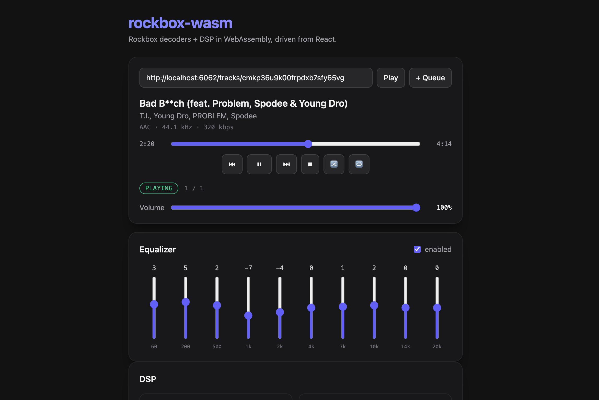

# rockbox-wasm — React + TypeScript + Vite example

A player UI (now-playing, transport, seek, volume, 10-band EQ, the full DSP
chain, live radio) built with React + Vite + Tailwind v4 on top of
[`rockbox-wasm`](../). All settings persist to localStorage via
[jotai](https://jotai.org) `atomWithStorage`.



Because this example lives *inside* the package, it resolves `rockbox-wasm` to
the local build (`../dist`) with a Vite alias + tsconfig `paths` rather than an
npm install — a real consumer would just `bun add rockbox-wasm`.

## Run it

```sh
# 1. Build the package once (needs Emscripten + the wasm Rust target):
(cd .. && bash scripts/build.sh)

# 2. Install + start the dev server (uses bun):
bun install
bun run dev            # → http://localhost:5173
```

A `copy-wasm` step (run automatically before `dev`/`build`) copies the built
`dist/` into `public/rockbox`, and the app points at it with
`new RockboxPlayer({ baseUrl: "/rockbox" })`.

No COOP/COEP headers are required — the build is single-threaded.

## Files

- `src/App.tsx` — the UI (transport, seek, volume, EQ)
- `src/DspPanel.tsx` — the full DSP chain (ReplayGain, tone, crossfeed, PBE,
  surround, compressor, channel)
- `src/settings.ts` — all settings as jotai `atomWithStorage` atoms +
  `applySettings` (pushed to the player once the engine boots)
- `src/useRockbox.ts` — a hook that owns a `RockboxPlayer` and mirrors its
  events into React state
- `scripts/copy-wasm.mjs` — copies the package's `dist/` into `public/rockbox`
- `vite.config.ts` — React + Tailwind v4 + the `rockbox-wasm` → `../dist` alias
