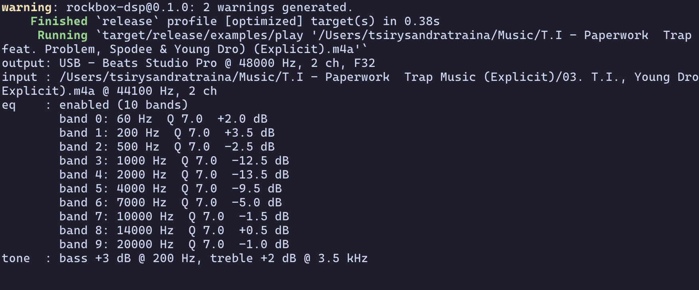

# rockbox-dsp

[](https://crates.io/crates/rockbox-dsp)
[](https://docs.rs/rockbox-dsp)
[](https://www.gnu.org/licenses/old-licenses/gpl-2.0.en.html)

The Rockbox DSP pipeline ([lib/rbcodec/dsp/](https://github.com/tsirysndr/rockboxd/tree/master/lib/rbcodec/dsp)) extracted into a standalone
static library with Rust bindings — no firmware, no kernel, no SDL. Drop
Rockbox's audio processing into any Rust player (symphonia, cpal, rodio, …).



## Table of Contents

- [Pipeline stages](#pipeline-stages)
- [Install](#install)
- [How it's built](#how-its-built)
- [Units — everything is tenths](#units--everything-is-tenths)
- [Replaygain](#replaygain)
- [Examples](#examples)
- [Settings read by the `play` example](#settings-read-by-the-play-example)
  - [EQ band format](#eq-band-format)
- [Real-world projects using this library](#real-world-projects-using-this-library)
- [Caveats](#caveats)

## Pipeline stages

Fixed order, each individually enable-able:

| Stage             | Source            | Notes                                  |
| ----------------- | ----------------- | -------------------------------------- |
| Pre-gain (PGA)    | `pga.c`           | replaygain / EQ precut                 |
| Timestretch       | `tdspeed.c`       | pitch/speed control                    |
| Resampler         | `resample.c`      | engages when input rate ≠ output rate  |
| Crossfeed         | `crossfeed.c`     | headphone stereo crossfeed             |
| 10-band EQ        | `eq.c`            | band 0 low shelf, band 9 high shelf    |
| Tone controls     | `tone_controls.c` | bass / treble                          |
| Bass enhancement  | `pbe.c`           | perceptual bass enhancement            |
| Fatigue reduction | `afr.c`           | auditory fatigue reduction             |
| Haas surround     | `surround.c`      |                                        |
| Channel modes     | `channel_mode.c`  | mono / karaoke / swap / custom width   |
| Compressor        | `compressor.c`    | dynamic-range compressor               |

All fixed-point C — no floats in the audio path, no allocations in the
hot path, no OS dependencies.

## Install

```sh
cargo add rockbox-dsp
```

A C compiler is required at build time (`cc` crate). No other system
dependencies — the DSP is freestanding fixed-point C.

## How it's built

`build.rs` compiles the DSP sources with `cc`: inside the rockbox source
tree straight from `lib/rbcodec/dsp/` + `lib/fixedpoint/`, and in the
published crate from the self-contained `vendor/` copy (re-synced with
`./sync-vendor.sh` before publishing). The `shim/` directory supplies
stub headers (`settings.h`, `config.h`, `sound.h`, `core_alloc.h`,
`replaygain.h`, `logf.h`, `debug.h`) that shadow the firmware ones, and
`rbdsp_shim.c` provides a malloc-backed `core_alloc`, `find_first_set_bit`,
`get_replaygain_int`, and the `REPLAYGAIN_SET_GAINS` message sender. This
mirrors what upstream Rockbox's standalone test player
(`lib/rbcodec/test/warble.c`) does.

## Units — everything is tenths

Per `dsp_filter.c`, gain and Q values are fixed-point ×10:

| Field                    | Unit         | Example        |
| ------------------------ | ------------ | -------------- |
| `eq_band_setting.gain`   | dB × 10      | −125 = −12.5 dB|
| `eq_band_setting.q`      | Q × 10       | 70 = Q 7.0     |
| `eq_band_setting.cutoff` | Hz (raw)     | 4000 = 4 kHz   |
| `dsp_set_eq_precut`      | dB × 10      | 120 = 12.0 dB  |

The safe wrapper's `set_eq_band(band, hz, q, gain_db)` takes plain units
and applies the ×10 internally; `set_eq_band_raw` takes native units
(e.g. straight from rockboxd's `[[eq_band_settings]]`).

## Replaygain

Replaygain is applied by the pre-gain (PGA) stage. Two calls, both
required before it engages:

```rust
use rockbox_dsp::{Dsp, REPLAYGAIN_TRACK};

let mut dsp = Dsp::new(44100);

// Once, from player settings: mode, clipping prevention, preamp in dB
dsp.set_replaygain(REPLAYGAIN_TRACK, true, 0.0);

// On every track change, from the file's tags: gains in dB,
// peaks as linear amplitude (1.0 = full scale), None = tag absent
dsp.set_replaygain_gains(Some(-8.97), Some(-9.04), Some(0.988), Some(1.0));
```

Modes are `REPLAYGAIN_TRACK`, `REPLAYGAIN_ALBUM`, `REPLAYGAIN_SHUFFLE`
(track gain when shuffling, album gain otherwise) and `REPLAYGAIN_OFF`.
With `noclip = true` the gain is capped so `gain × peak` never exceeds
full scale — this works even on gainless tracks if a peak is tagged.

`set_replaygain_gains_raw` takes native Q7.24 linear factors instead —
the exact values Rockbox's metadata parser stores in `mp3entry`
(`get_replaygain_int` output, also re-exported by this crate).

## Examples

```sh
# Sine → EQ → verify -12 dB attenuation (no audio device needed)
cargo run --release -p rockbox-dsp --example eq_sine

# Real player: symphonia decode → Rockbox DSP (EQ from
# ~/.config/rockbox.org/settings.toml, resample to device rate) → cpal
cargo run --release -p rockbox-dsp --example play -- /path/to/track.flac
```

## Settings read by the `play` example

The `play` example reads `./settings.toml` from the current directory if
present, falling back to rockboxd's `~/.config/rockbox.org/settings.toml`:

| Key                     | DSP stage      | Meaning                                    |
| ----------------------- | -------------- | ------------------------------------------ |
| `eq_enabled`            | equalizer      | bool                                       |
| `[[eq_band_settings]]`  | equalizer      | up to 10 bands (see below)                 |
| `bass` / `treble`       | tone controls  | shelf gain in dB                           |
| `bass_cutoff`           | tone controls  | shelf cutoff in Hz, 0 = default 200        |
| `treble_cutoff`         | tone controls  | shelf cutoff in Hz, 0 = default 3500       |
| `surround_enabled`      | Haas surround  | delay in ms, 0 = off                       |
| `surround_balance`      | Haas surround  | percent                                    |
| `surround_fx1` / `fx2`  | Haas surround  | band-split cutoffs in Hz                   |
| `channel_config`        | channel modes  | 0 stereo, 1 mono, 2 custom, 5 karaoke, …   |
| `stereo_width`          | channel modes  | percent; audible with `channel_config = 2` |
| `[compressor_settings]` | compressor     | threshold dB (0 = off), ratio/knee idx, ms |


### EQ band format

```toml
eq_enabled = true

# Up to 10 bands, in pipeline order: band 0 is a low shelf,
# band 9 a high shelf, bands 1-8 are peaking filters.
# q and gain are in native Rockbox tenths: q = 70 → Q 7.0,
# gain = -125 → -12.5 dB. cutoff is plain Hz.

[[eq_band_settings]]
cutoff = 60
q = 70
gain = 20      # +2.0 dB

[[eq_band_settings]]
cutoff = 200
q = 70
gain = 35      # +3.5 dB

[[eq_band_settings]]
cutoff = 500
q = 70
gain = -25     # -2.5 dB

[[eq_band_settings]]
cutoff = 1000
q = 70
gain = -125    # -12.5 dB

[[eq_band_settings]]
cutoff = 2000
q = 70
gain = -135    # -13.5 dB

[[eq_band_settings]]
cutoff = 4000
q = 70
gain = -95     # -9.5 dB

[[eq_band_settings]]
cutoff = 7000
q = 70
gain = -50     # -5.0 dB

[[eq_band_settings]]
cutoff = 10000
q = 70
gain = -15     # -1.5 dB

[[eq_band_settings]]
cutoff = 14000
q = 70
gain = 5       # +0.5 dB

[[eq_band_settings]]
cutoff = 20000
q = 70
gain = -10     # -1.0 dB
```

These values map 1:1 onto `eq_band_setting` and are passed through
`Dsp::set_eq_band_raw` untouched — no unit conversion.

## Real-world projects using this library

- [fin](https://github.com/tsirysndr/fin) — a neon-electric TUI Jellyfin
  client for mpv, Chromecast & UPnP MediaRenderer
- [tunein-cli](https://github.com/tsirysndr/tunein-cli) — browse and listen
  to thousands of radio stations across the globe right from your terminal

## Caveats

- **License**: the compiled C sources are GPL-2.0-or-later; linking them
  makes the consuming binary GPL.
- **Singleton**: `dsp_core.c` holds static instances (audio + voice). One
  processing stream per instance, single-threaded — `Dsp` is not `Send`.
- The safe wrapper covers interleaved S16 stereo; the raw FFI supports
  everything `dsp_core.h` does (mono, non-interleaved, up to 32-bit depth).
